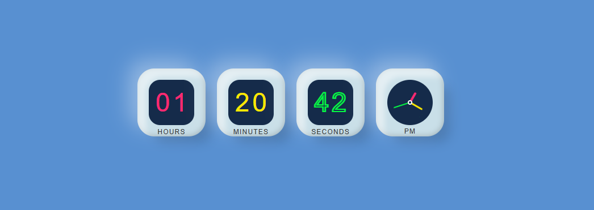

## Project Name : Digital-and-Analog-Clock

## Live Demo
You can view a live demo of the project [Click Here](https://pranto113015.github.io/Digital-and-Analog-Clock/).

## Features
- Digital clock
- Analog Clock

## Technologies Used  

- HTML5
- CSS3
- Javascript
## How to Run the Project Manually
If you run this project locally, follow these steps

1. Clone the Repository
2. Navigate to the Project Directory
3. Open the project by vs code applicaton
4. Click the run option of the menu bar and again click the start debugging

 Or you can do this way
  1. Download the project
  2. unzip file
  3. open with your IDE such as vs code

## Contact
If you have any questions or need further clarification, please feel free to reach out to me

> 📪 Email : pranto113015@gmail.com

> 🔍 Linkedin : [Pranto Kumar](https://www.linkedin.com/in/pranto-kumar-a326801b3/)

  💙 Thank you for reviewing my project!